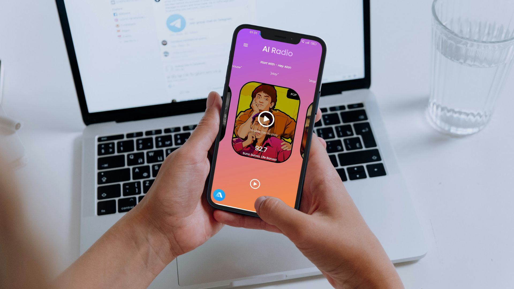
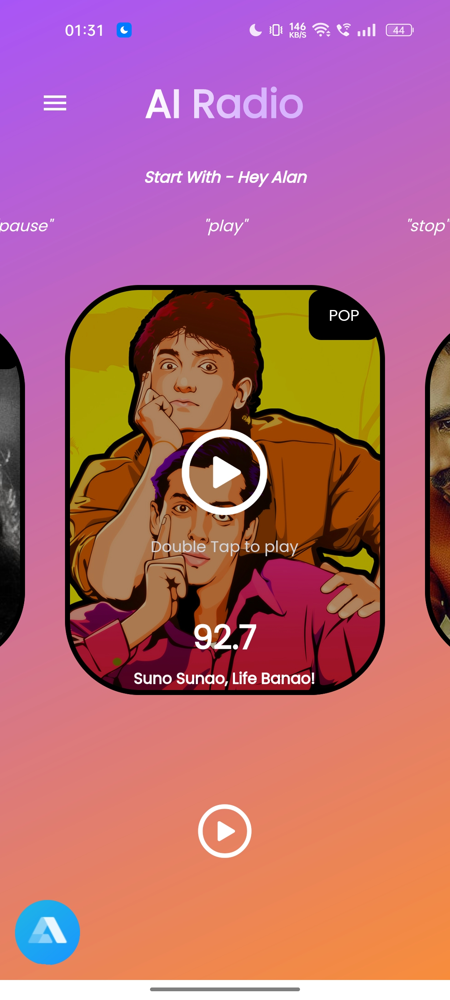
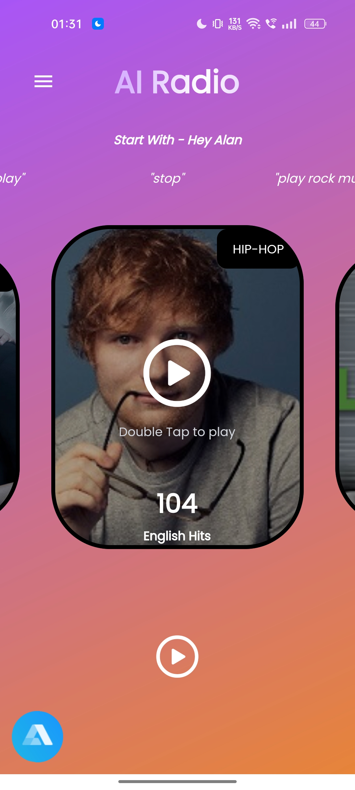
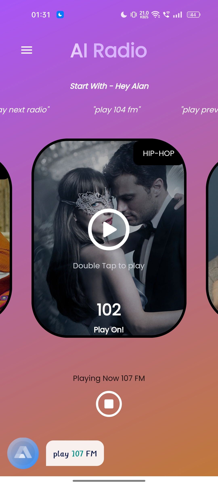
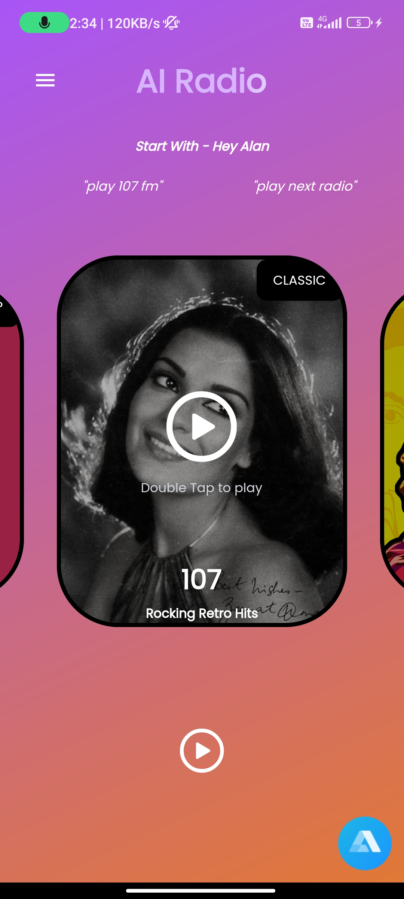
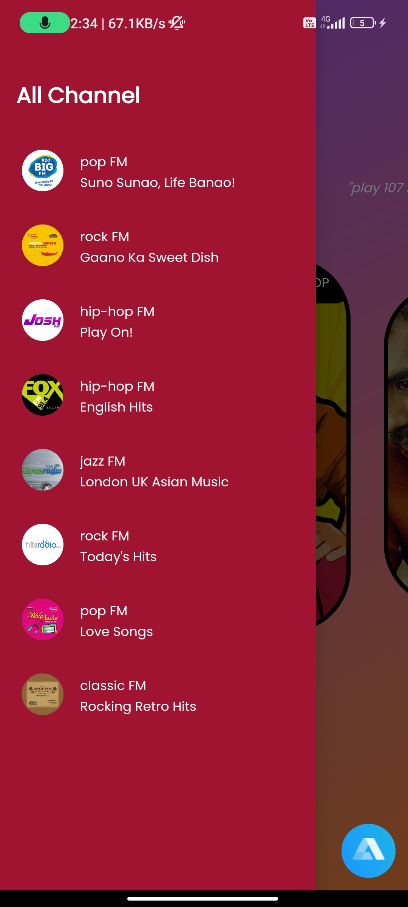

# AI-Powered Voice Assistant Flutter Radio App

This is a radio app where you can ask Alan AI to play some music.

<p align="center">
  <a href="https://youtu.be/p4xh7zTt6i0" target="_blank">
    
  </a>
</p>

## Installation

To install this project run

Step 1: 
```bash
  git clone https://https://github.com/grsendha/ai_radio_app
```
Step 2:
```bash
  flutter pub get 
```

## Library Used

- velocity_x
- audioplayers
- google_fonts
- alan_voice


---


## Some screenshots

|                                      |                                      |
| ------------------------------------ | ------------------------------------ |
|  |  |
|   |   |
|   |

---

